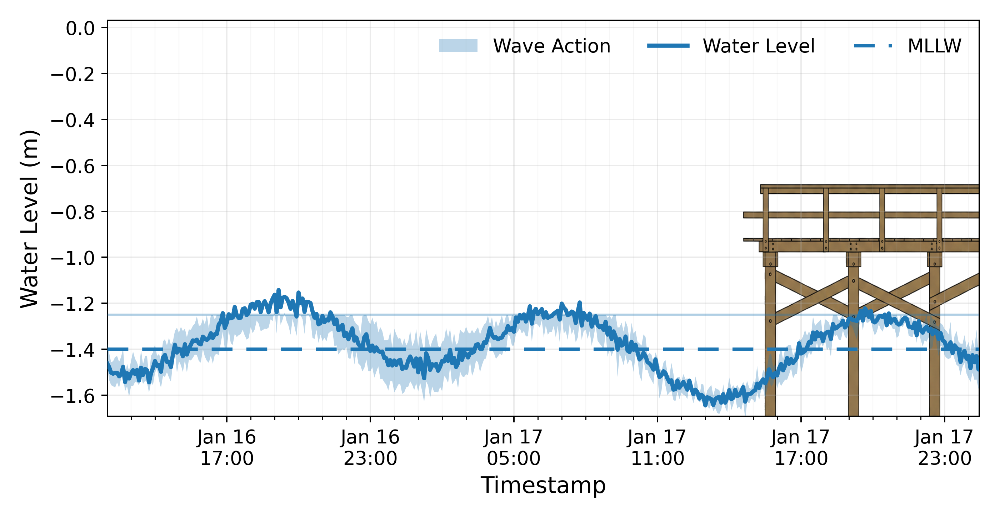

# ContextPlot

ContextPlot is a small Python package that places a real world image (design, site diagram, schematic, CAD export) directly into a data plot.

The goal is simple: turn a standard time series figure into a context driven visual where the meaning of the signal is immediately clear.

## Why this exists

Most plots show data accurately, but not always intuitively.

ContextPlot helps by anchoring the data to something physical, so the viewer understands what the plot represents at a glance.




## Features

- Add a design or site image into a Matplotlib plot
- Control image position and scale in data coordinates
- Plot time series with bands (min max, uncertainty, envelopes)
- Optional clipping to a threshold (example: stop a band at a deck level)
- Export publication quality PNG and PDF

## Installation

Clone the repo:

```bash
git clone https://github.com/akaawase-bernard/contextplot.git
cd contextplot
pip install -r requirements.txt
```
